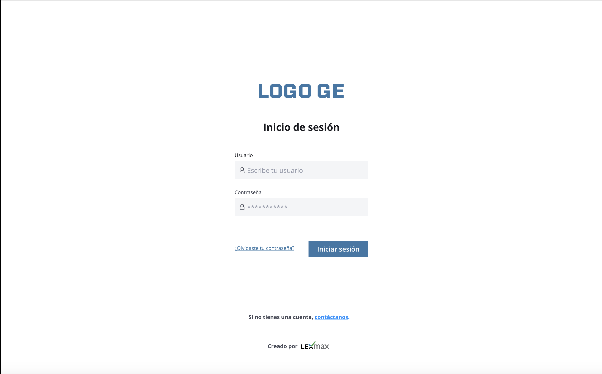
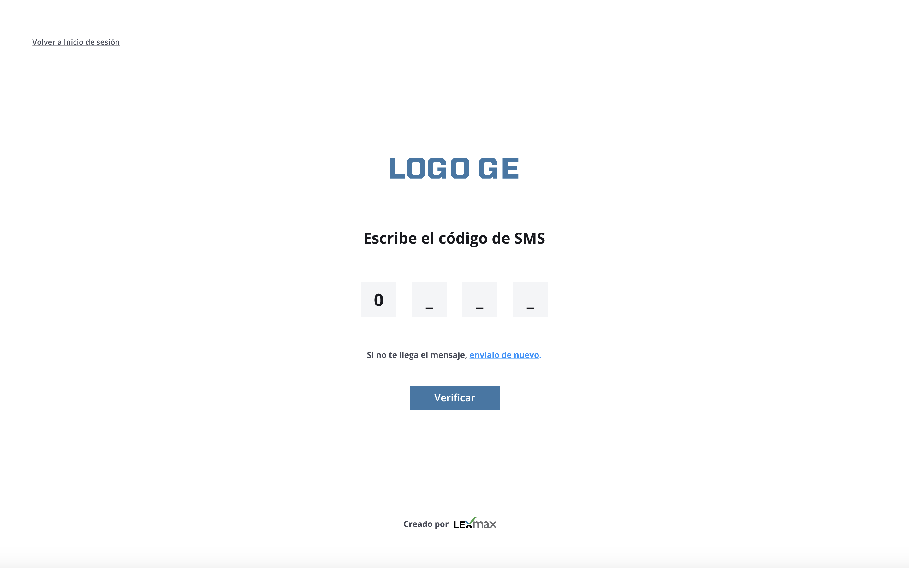
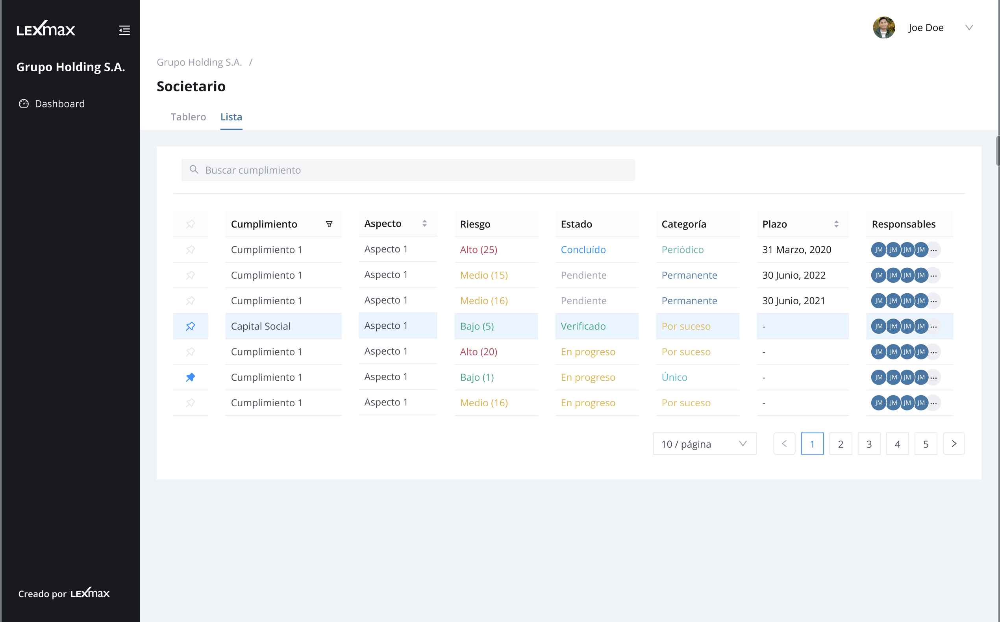
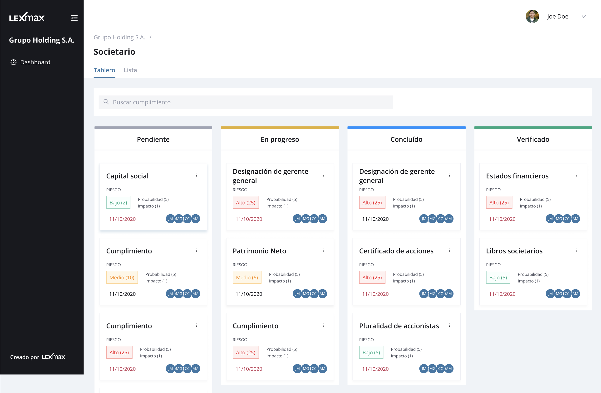
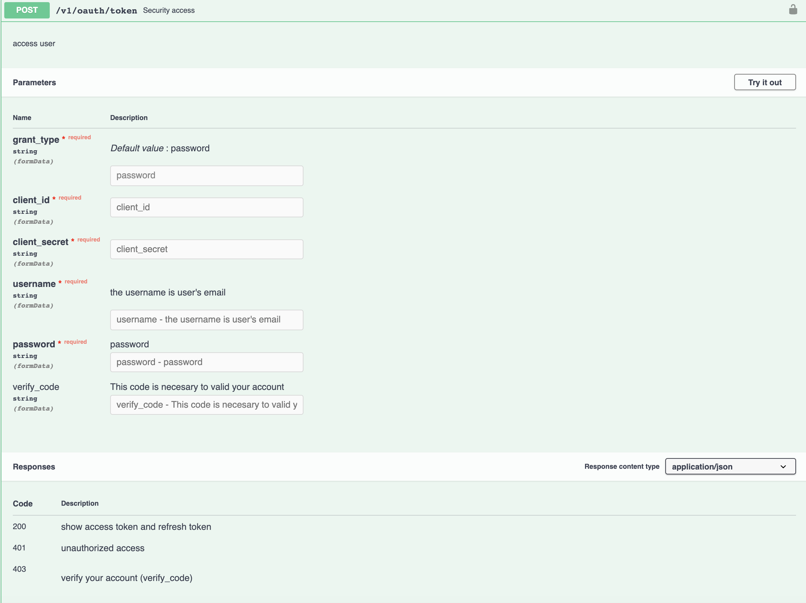
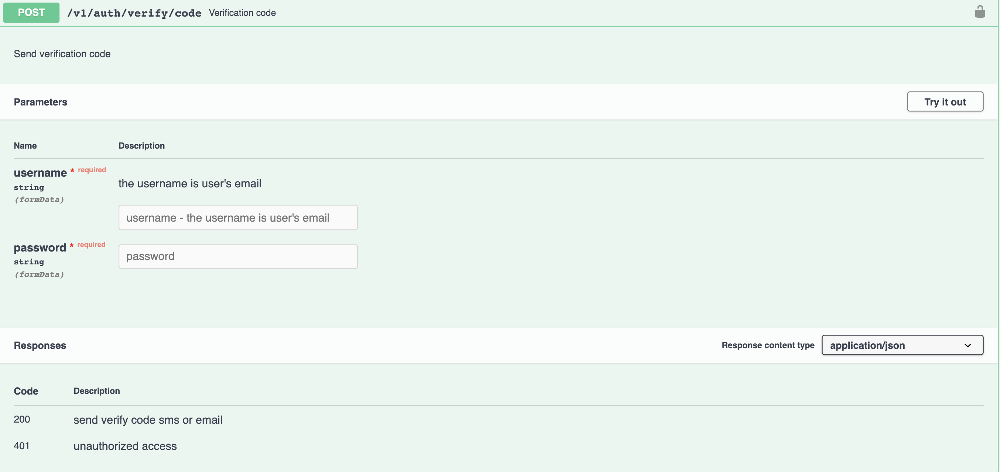
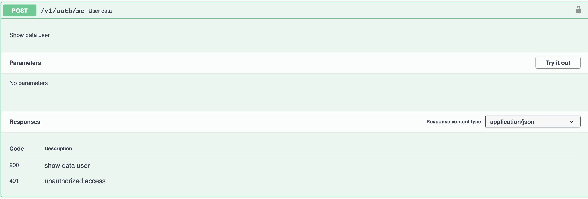
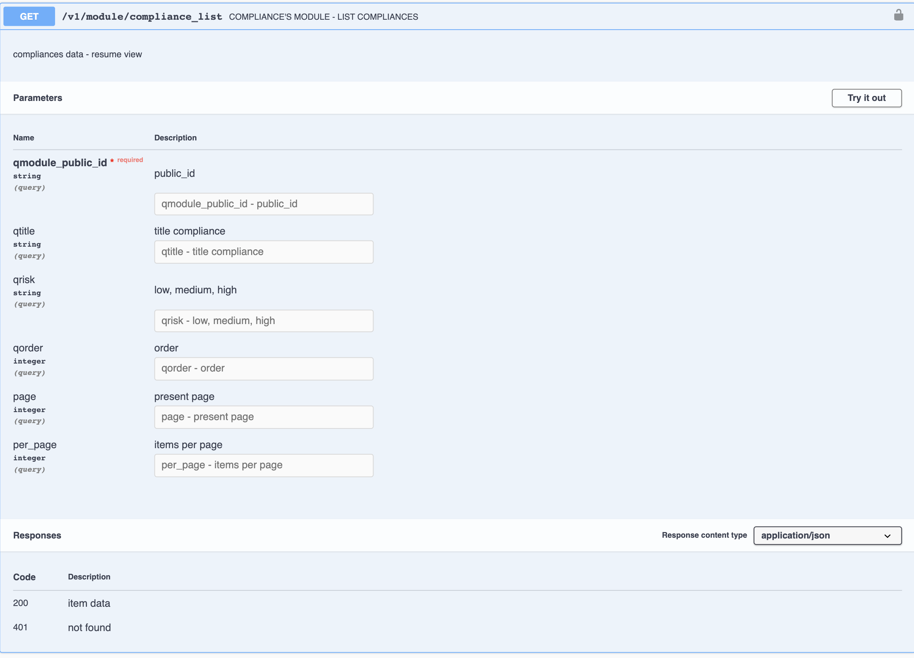
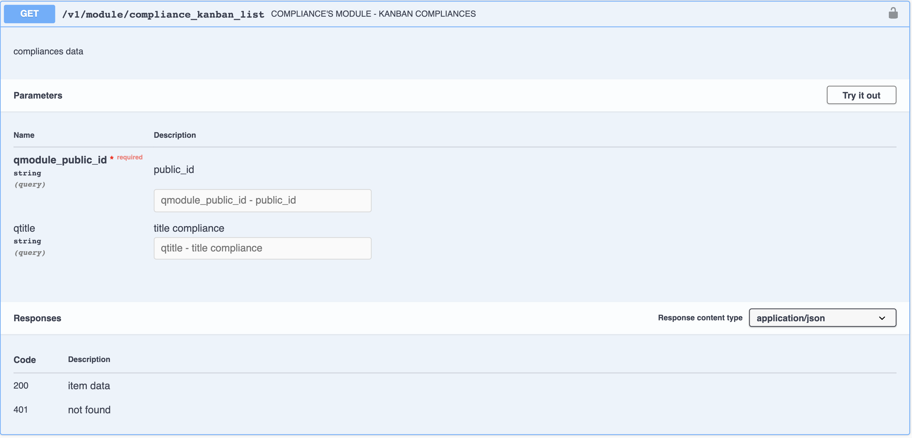
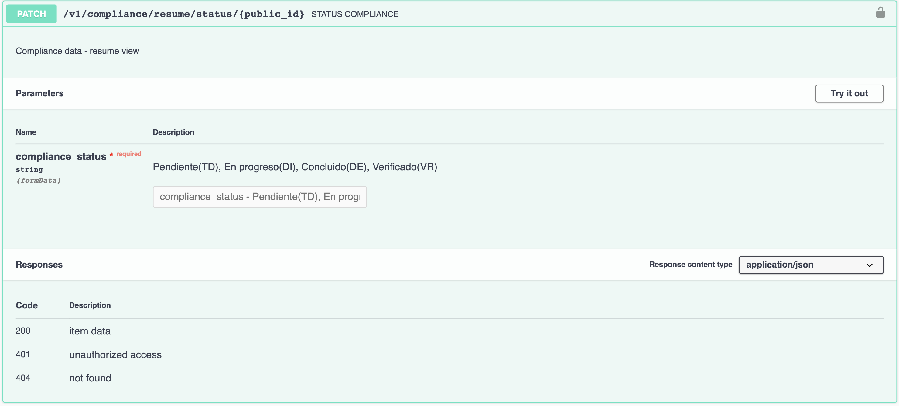

# Challengue-Lx

PROBLEMÁTICA:
-------------

Las actividades que debe realizar un profesional dentro de una empresa se encuentran registrados en una plataforma.
Para acceder a ellos el profesional debe tener la capacidad de ingresar de manera segura. Y poder gestionar sus tareas desde una lista y/o tablero de Kanban

FUNCIONALIDADES:
---------------

La plataforma cumple con una gestión básica.

1.- Login:
^^^^^^^^^^

Inicio de sesión a travez de un usuario y contraseña.

2.- Verificar código:
^^^^^^^^^^^^^^^^^^^^^

Este paso se realiza la primera vezque se crea la cuenta. Y luego cada cierto número de días

3.- Listado:
^^^^^^^^^^^^

Aquí debemos tener en un tabla la lista de actividades a realizar.

4.- Kanban:
^^^^^^^^^^^^

Esta vista nos proporciona la actividades en columnas y cada columna proporciona un estado. Mover la tarjeta de columna en columna debería permitir el cambio de estado de la actividad.

BACKEND:
--------

Tenemos un entorno de pruebas para que implementar la interfaz que ayudara a la gestión de cumplimientos.

APIS:
-----
Para la gestión de cumplimientos, contamos con las siguientes apis:

1.- Access token:
^^^^^^^^^^^^^^^^

Para acceder a la plataforma, y consumir las otras api se necesita crear el token para ello se deben usar los siguientes datos:

- grant_type: password
- username: [your mail]
- password: 123456
- client_id: 1mkstVDJvOFxla31cTMi1tDi
- client_secret: tlJ2lmYJEGRGjRLva4Y5eTYgZnuvTiMRaYTas5Xv2cIK0f42
- verify_code: Este valor es opcional y se optiene a travez de sms cada vez que se necesita verificar la autenticidad de un usuario.

Si el api devuelve un 403. Siginifica que el usuario necesita una segunda validación para acceder a la plataforma, y para ello se debe consumir nuevamente el API(/v1/oauth/token) con el valor adicional "verify_code". Este valor es un número de 4 digitos que llega a travez de SMS. Una vez que consumimos el API con el valor opcional (verify_code). EL api nos devolvera el "access_token"

`http://dev.api.lexmax.pe/v1/oauth/token`

2.- Verify code:
^^^^^^^^^^^^^^^^

Esta Api solo tiene como unico fin proporcionar un nuevo código de verficación.

`http://dev.api.lexmax.pe/v1/auth/verify/code`

3.- Me
^^^^^^

Este api proporciona los datos del usuario. Para ello se le debe proporcionar el "access_token".

`http://dev.api.lexmax.pe/v1/auth/me`

4.- Compliance list:
^^^^^^^^^^^^^^^^^^^^

Este api nos proporciona la lista de cumplimiento.

`http://dev.api.lexmax.pe/v1/module/compliance_list?qmodule_public_id=aacaf015-e00e-42bd-9e06-5fc8d3e2997b`

5.- Compliance kanban:
^^^^^^^^^^^^^^^^^^^^^^
Este api nos proporciona la lista de cumplimiento por modulo.

`http://dev.api.lexmax.pe/v1/module/compliance_kanban_list?qmodule_public_id=aacaf015-e00e-42bd-9e06-5fc8d3e2997b`

6.- Compliance change status:
^^^^^^^^^^^^^^^^^^^^^^^^^^^^^^

Api para cambiar el estado del cumplimiento.

`http://dev.api.lexmax.pe/v1/compliance/resume/status/{public_id}`

DESAFÍOS A ALCANZAR:
-------------------

Este es un desafío de next y no de diseño. En este desafío debes mostrar tu habilidades en el manejo de tecnologías como:

- Typescript
- Next
- Uso de Ant design 

REQUISITOS:
-----------

- Se necesita utilzar el la última versión estable de NODEJS y la solución debe encontrarse en un repositorio. El repositorio debe contener un archivo que explique como ejecutar el aplicativos (README).
- Para la realizacion del tablero de kanban podria utilizar la libreria de react-trello como opcion a desarrollar el tablero .
- Se recomienda usar los componentes de ant design para las vistas mostradas .

